# Assignment5 Report


## File Tree (Bonus implemented in main.c)

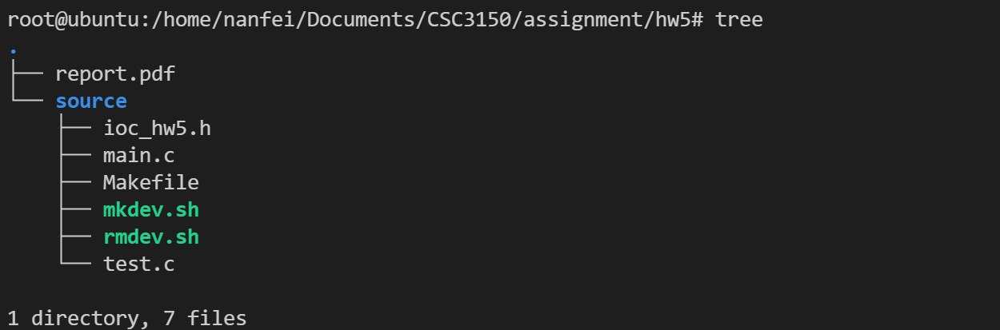

```
.
├── report.pdf
└── source
    ├── ioc_hw5.h
    ├── main.c
    ├── Makefile
    ├── mkdev.sh
    ├── rmdev.sh
    └── test.c

1 directory, 7 files
```


## 1. Running Environment

Version of OS: Ubuntu **16.04.5 LTS**

```shell
lsb_release -a
```

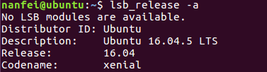

OS Kernel Version: **4.15.0**

```shell
uname -r
```

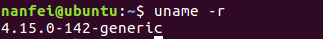


## 2. Execution Steps

### Preparations

* Unzip the file and come to the directory of source file.


### Execution

* Compile the code and install the kernel module

* ```shell
  make all
  ```

* Get the MAJOR & MINOR number

* ```shell
  dmesg | tail -5
  ```

* Make your own device.

* ```shell
  ./mkdev.sh MAJOR MINOR
  ```

* Run the test program / Perform some keyboard interrupts.

* ```shell
  ./test
  ```

* Clean the compiled files and see the results.

* ```shell
  make clean
  ```

* Clean the kernel message to clean all outputs in this execution.

* ```shell
  dmesg -c
  ```

  


## 3. Program Design

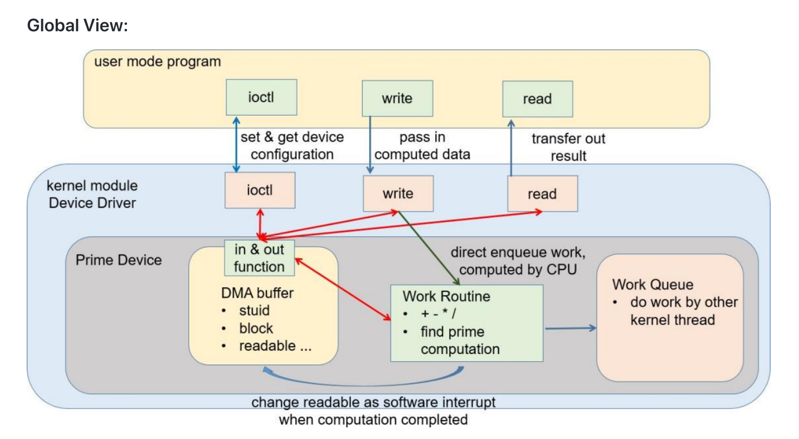

### Basic Task

​	In this program, we **follow the global** view provided as the homework requirements.

#### Initialization

​	There are **many steps to perform** in the initialization (basically as the same as the instructions in the comment).

* Register the character device

  ```c
  ret = alloc_chrdev_region(&dev, 0, 1, "mydev");
  ```

* Initialize the character device and make it alive

  ```c
  dev_cdevp = cdev_alloc();
  cdev_init(dev_cdevp, &fops);
  dev_cdevp->owner = THIS_MODULE;
  ret = cdev_add(dev_cdevp, MKDEV(dev_major, dev_minor), 1);
  ```

* Allocate DMA buffer

  ```c
  dma_buf = kzalloc(DMA_BUFSIZE, GFP_KERNEL); // simulate register and memory on device, kmalloc a dma buffer
  ```

* Allocate work routine

  ```c
  work_routine = kmalloc(sizeof(typeof(*work_routine)), GFP_KERNEL);
  ```

#### Exit

​	In the module exit, we should free the space we have allocated and clean the device we have made.

* Free DMA buffer

  ```c
  kfree(dma_buf);
  ```

* Delete character device

  ```c
  cdev_del(dev_cdevp);
  unregister_chrdev_region(dev, 1);
  ```

* Free work routine

  ```c
  kfree(work_routine);
  ```

#### IO control from user

​	In this function (drv_ioctl),we should pass the arguments from users to the corresponding address of the DMA buffer. Therefore, we distinguish the **cmd** parameter to decide where to place the users' argument.

* Get argument from users

  ```c
  get_user(cur_arg, (int *)arg);
  ```

* Decide where to place the users' arguments

  ```c
  switch (cmd)
  	{
  	case HW5_IOCSETSTUID:
  		...
  	case HW5_IOCSETRWOK:
  		...
  	case HW5_IOCSETIOCOK:
  		...
  	case HW5_IOCSETIRQOK:
  		...
  	case HW5_IOCSETBLOCK:
  		...
  	case HW5_IOCWAITREADABLE:
  		...
  	default:
  		break;
  	}
  ```

* Do the argument assignment

  ```C
  myouti(cur_arg, TARGET_ADDRESS);
  ```

* Retrieve from the target address to validate

  ```C
  res = myini(TARGET_ADDRESS);
  printk("result as %d\n", TARGET_ADDRESS)
  ```

#### Read

​	In this function (drv_read()), we get the result from the **ANS** address of DMA buffer and set the readable flag as **false**.

* Get the result and send to user space memory

  ```c
  unsigned int res = myini(DMAANSADDR);
  put_user(res, (unsigned int *)buffer);
  ```

* Clean the result and the readable flag

  ```c
  myouti(0, DMAREADABLEADDR);
  myouti(0, DMAANSADDR);
  ```

#### Write

​	In this function (drv_write()), we need to perform the user work in two manner: blocking and non-blocking.

* Get operand from user (a, b, c) and store in DMA buffer

  ```c
  dataIn = kmalloc(sizeof(typeof(*dataIn)), GFP_KERNEL);
  copy_from_user(dataIn, buffer, ss);
  myoutc((unsigned char)dataIn->a, DMAOPCODEADDR);
  myouti((unsigned int)dataIn->b, DMAOPERANDBADDR);
  myouti((unsigned short)dataIn->c, DMAOPERANDCADDR);
  ```

* Initialize a work routine to perform arithmetic

  ```c
  INIT_WORK(work_routine, drv_arithmetic_routine);
  ```

* Do in the blocking manner if isBlocking = true

  ```c
  schedule_work(work_routine); // put the work task in global workqueue
  flush_scheduled_work();
  ```

* Do in the non-blocking manner if isBlocking = false

  ```c
  schedule_work(work_routine);
  ```

  

#### Arithmetic Routine

​	This function (static void drv_arithmetic_routine(struct work_struct *ws)) is actually the work routine invoked in the write operation. We need to distinguish the operations to perform, store the results, and set the readable flag for users to get the result back.

* Distinguish the operation

  ```c
  switch (opcode)
  	{
  	case '+':
  		...
  	case '-':
  		...
  	case '*':
  		...
  	case '/':
  		...
  	case 'p':
  		...
  	default:
  		
  	}
  ```

* Do the operations and write result to DMA buffer

  ```c
  ans = myini(DMAOPERANDBADDR) [operator] (unsigned int)myins(DMAOPERANDCADDR);
  // or
  ans = prime(myini(DMAOPERANDBADDR), myins(DMAOPERANDCADDR));
  myouti(ans, DMAANSADDR);
  ```

* Set the readable flag

  If the operations are in the non-blocking manner, the user should wait for its completion by checking the **readable** flag. Therefore, we should set the **readable** as true to let users read the answer.

  ```c
  if (isBlocking == 0)
  		myouti(1, DMAREADABLEADDR);
  ```

  

### Bonus Task

#### Initialization

​	In the initialization of bonus part, we should initialize the IRQ by request_irq():

```c
#define IRQ_NUM 1
typedef irqreturn_t (*irq_handler_t)(int, void *);
printk("%s:%s(): request_irq %d returns %d\n", PREFIX_TITLE, __func__, IRQ_NUM, request_irq(IRQ_NUM, (irq_handler_t)handler, IRQF_SHARED, "OS_ASS5 DEVICE", (void *)dev_cdevp));
```

(We set the IRQ_NUM as the same as the tutorial).

​	In our interrupt handler, we add one to the interrupt count, which is stored in the DMA buffer.

```c
myouti(myini(DMACOUNTADDR) + 1, DMACOUNTADDR);
```

​	At last, when we are going to exit the module, we should free the interrupt allocated by request_irq():

```c
free_irq(IRQ_NUM, (void *)dev_cdevp);
```


## 4. Execution Results Demonstration

All the tests follow the execution steps above, and the test results are screenshots of output.

### Execution Steps - Test

```shell
make all
```

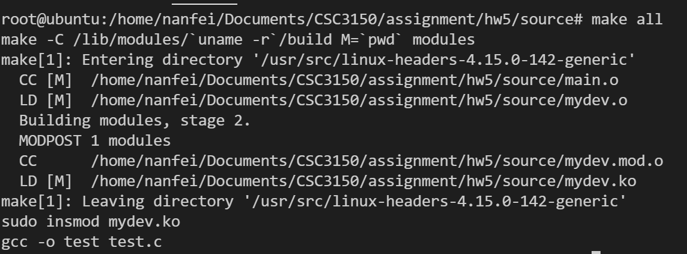

```shell
dmesg | tail -5
```

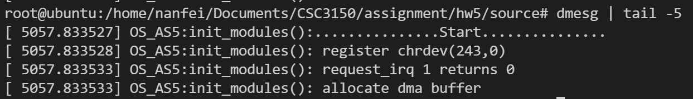

```shell
./mkdev.sh  243 0
```

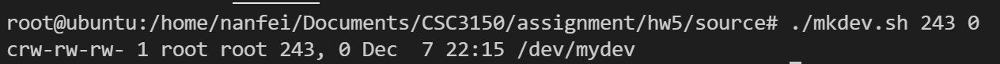

```shell
./test
```

```shell
# click your keyboard
```

```shell
make clean
```

The results of the $3$ steps above are shown in screenshots in the next part, which is to validate the functionality of the program.


### Screenshot Result for Basic and Bonus Task

#### Basic (Not testing the keyboard now)

* Results after running the test program:
* 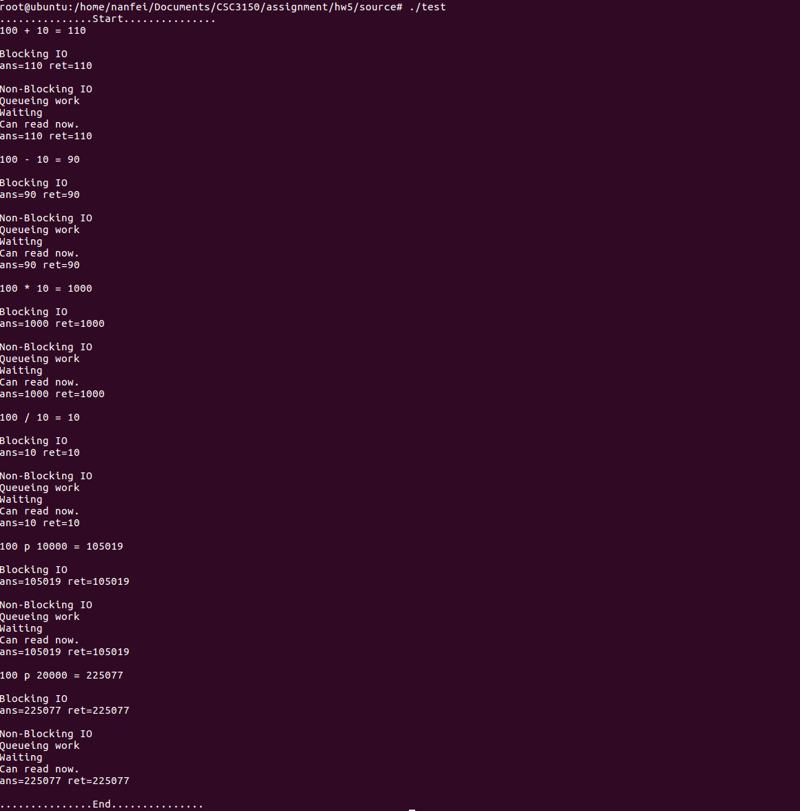

* Results after make clean to display kernel message
* 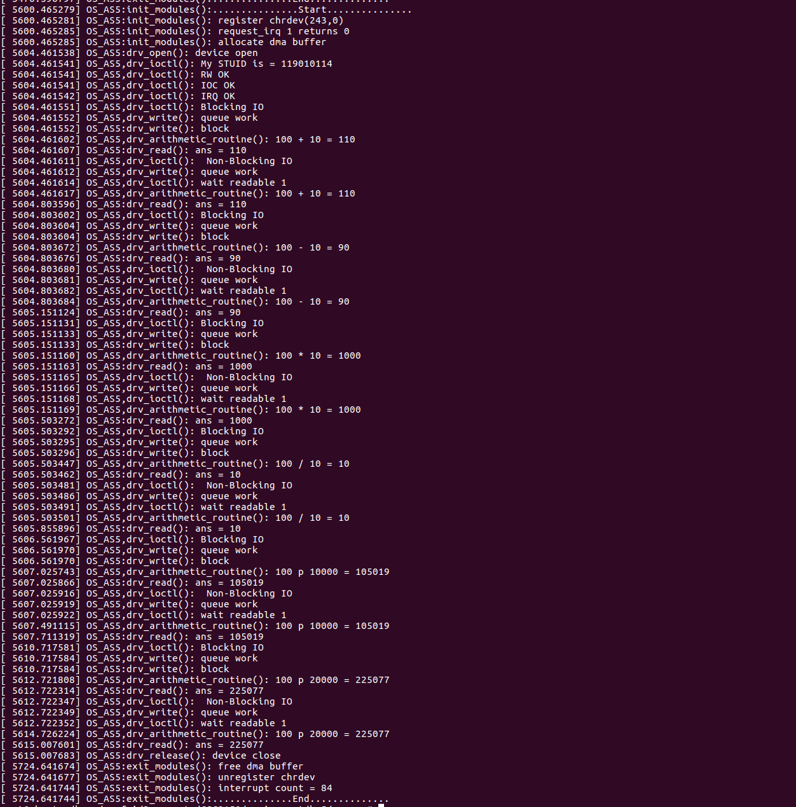


#### Bonus (Testing on the keyboard interrupt)

* Results after make clean to display kernel message
* Push the keyboards third times.
* 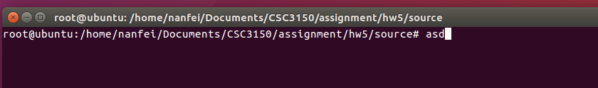

* Get the interrupt count result as $6$, two interrupts per push.
* 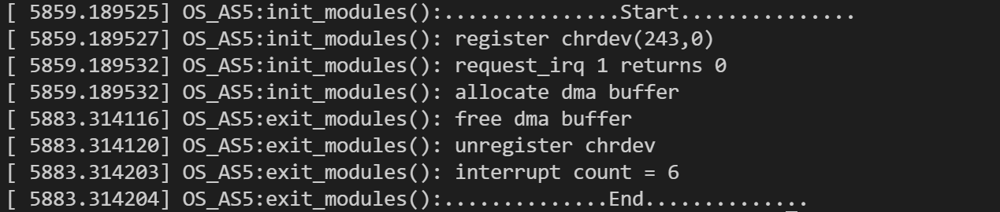


## 5. Conclusion

​	According to the tests results, we can conclude that the design and code implementation of these three programs are **successful**.

​	In these tasks, I learnt:

* User program can control the IO device / controller with the help of kernel.
* There is data transfer between user space and kernel space when doing the IO operations.

